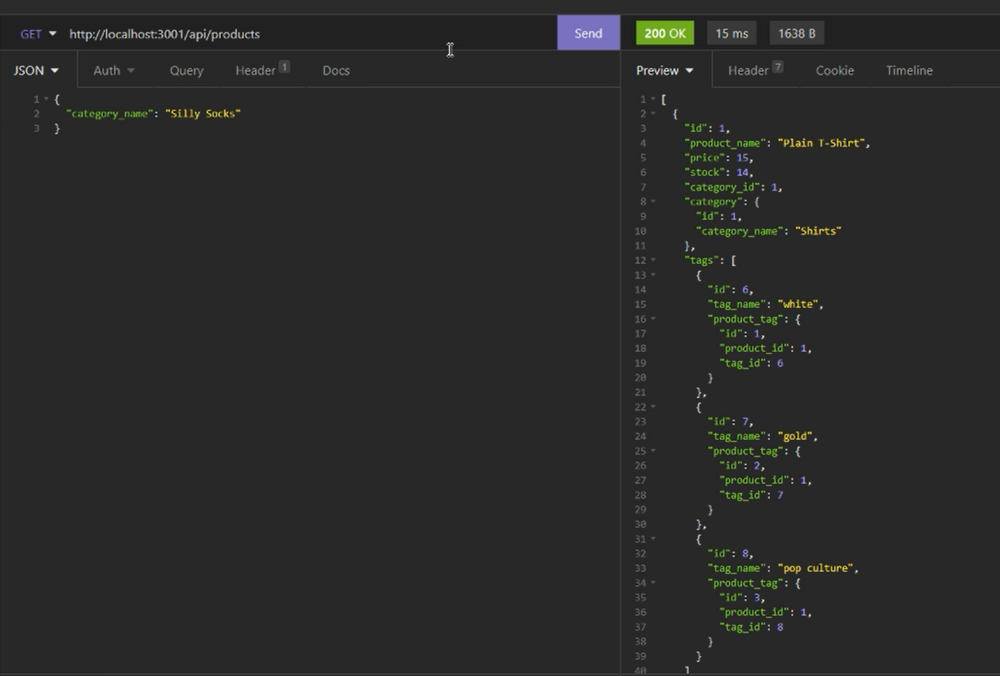
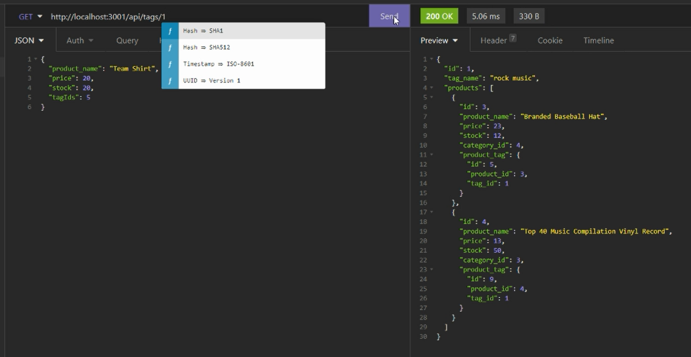

# Welcome to my E-COMMERCE BACK END!

## Description

#### This e-commerce back end allows a manager at an internet retail company to view the back end of their e-commerce website so they can compete with other e-commerce companies. 

## Table of Contents
* [Installation](#installation)
* [Usage](#usage)
* [License](#license)
* [Contributor](#contributor)
* [Demo](#demo)

## Installation
In order to run this e-commerce back end, you will need to run npm install.

## Usage
To use this app, clone this repository, navigate into the Develop folder, and run server.js on the command-line to start.

You will then see the confirmation that the database is created and the app is listening.

Inside Insomnia, you can view all the categories by using api/categories endpoint. 

You can then choose to view a category by the ID by adding the ID to the endpoint.

You can post a new category to the database.

By adding the new category ID to the endpoint, you can perform a PUT request to edit the category.

By adding the category ID to the endpoint, you can delete a category. You will receive confirmation of how many categories you deleted.

When you attempt to get the deleted category, you will receive confirmation that the deleted category does not exist.

You can also view all the products by using api/products endpoint. 

You can then choose to view a product by the ID by adding the ID to the endpoint.

You can post a new product to the database.

By adding the new product ID to the endpoint, you can perform a PUT request to edit the product.

By adding the product ID to the endpoint, you can delete a product. You will receive confirmation of how many products you deleted.

When you attempt to get the deleted product, you will receive confirmation that the deleted product does not exist.

You can also view all the tags by using api/tags endpoint. 

You can then choose to view a tag by the ID by adding the ID to the endpoint.

You can post a new tag to the database.

By adding the new tag ID to the endpoint, you can perform a PUT request to edit the tag.

By adding the tag ID to the endpoint, you can delete a tag. You will receive confirmation of how many tags you deleted.

When you attempt to get the deleted tag, you will receive confirmation that the deleted tag does not exist.

## License
The license for this project is the MIT.

Copyright © 2021

## Contributor
Jamie Williams

GitHub: [@jamwil1226](https://github.com/jamwil1226/)

## Addtional Contributors
Additional Contributors welcome! Reach out to me if you are interested!

## Demo
Watch this demo to see the e-commerce back end in action!
https://www.loom.com/share/20d2c747cbcc4be09428d35a9b388a00

## Questions
*If you have any questions, please reach out to me at* 

GitHub: [@jamwil1226](https://github.com/jamwil1226/)

Email: [jamwil1226@yahoo.com](mailto:jamwil1226@yahoo.com)

### I hope you enjoy viewing this e-commerce back end! I welcome all contributions and feedback!

### I look forward to hearing from you!

### _Jamie Williams_ 

